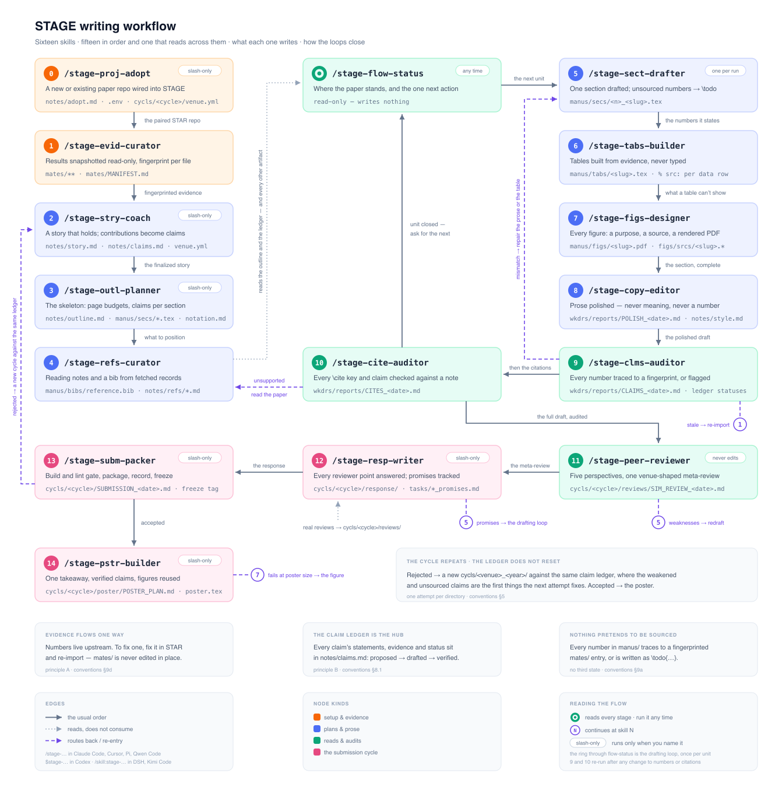

# 写作工作流 Skill 指南

**语言：** [English](writing-workflow-skills.md) | 简体中文

本文件是 `writing-workflow-skills.md` 的中文对照版，随英文版同步维护，供人阅读；两版冲突时以英文版为准。

STAGE 提供十六个彼此衔接的写作工作流 skill，把导入的证据和一个故事，变成一篇带可审计主张链的、已投出的论文：一个与研究项目配对好的仓库、一份每个文件都有指纹的只读证据库、一个贡献即被跟踪主张的故事、一份带页数预算的提纲、对着证据起草的章节、由证据生成而非手敲的表格、带可编辑源文件的图、核实过的参考文献、不碰数字的散文打磨、每个数字与每条引用都被审计、一份按 venue 自身格式写的模拟评审、一份带跟踪承诺的回复，一个冻结、打包好的投稿，以及把录用结果带进展厅的那张海报。

本指南每个 skill 一段紧凑的话。所有 skill 共用的规则——git、红线、`.env` 与构建工具链、日期、解析、委派、对话、产物登记表、编造边界、布局——住在 [writing-workflow-conventions.zh-CN.md](writing-workflow-conventions.zh-CN.md)（英文：[writing-workflow-conventions.md](writing-workflow-conventions.md)）；各 skill 引用它的 § 编号。本目录由上游管理：只在 STAGE 模板仓库里改它，绝不在某个论文实例里改——`execs/update.sh` 会覆盖它。

## 流水线

```text
一份已有的草稿，或一个全新的仓库
  → stage-proj-adopt: 把它接进 STAGE —— STAR 配对、venue、资产盘点，
    草稿里已有的数字登记为 unsourced 主张

证据（一个配对的 STAR 仓库，或手工投放的文件）
  → stage-evid-curator: 快照并登记 —— 指纹写进 mates/MANIFEST.md

故事
  → stage-stry-coach: story.md + 播下种子的主张台账 + 用户确认的 venue.yml
  → stage-outl-planner: 带页数预算的提纲、章节骨架、记号表种子
  → stage-refs-curator: 阅读笔记 + 一份干净的 reference.bib

  ┌─ 起草循环 —— 每节、每张表、每张图各进入一次 ────────────────────────────┐
  │  → stage-sect-drafter: 起草一节；没有指纹的数字 → \todo               │
  │  → stage-tabs-builder: 表格只来自 mates/ 证据，每行一条 % src:        │
  │  → stage-figs-designer: 图的源文件 → 渲染出的 PDF                     │
  │  → stage-copy-editor: 打磨 —— 不碰含义，不碰数字                       │
  └────────────────────────────────────────────────────────────────────────┘

审计 —— 便宜，随时重跑
  → stage-clms-auditor: 手稿里每个数字 ⇄ 一条带指纹的证据条目
  → stage-cite-auditor: 每个 \cite key 与每条断言 ⇄ 一份阅读笔记

投稿周期 —— 每个 cycls/<venue>_<year>/ 对应一次 venue 尝试
  → stage-peer-reviewer: 五视角模拟评审组，真实评审的格式
  → stage-resp-writer: 评审 → 逐点台账 → 回复 + 承诺复选框
  → stage-subm-packer: 构建+lint 把关、清单、转成 venue 自己的模板、打包、
    SUBMISSION 记录、freeze/<cycle>_<date> tag
  → stage-pstr-builder: 一句结论、verified 的主张、复用的图 →
    cycls/<cycle>/poster/ + 一道按印刷尺寸量出来的可读性闸

  ⌾ stage-flow-status: 任何时刻读上面的一切 ——
    现在到哪了，以及唯一的下一步动作连同它的确切命令
```

这份清单读起来像一趟直线，但工作流不是线性的。`stage-proj-adopt` 只跑一次，而且除了 `.env` 之外，只有在存在一份要吸收的旧草稿时才要紧。证据导入在上游结果移动时随时重来——指纹和 `import.sh --diff` 就是为此而设。起草循环按节重入，也按每条评审承诺重入；审计被设计成在每次触及数字或引用的改动之后重跑。周期类 skill 按每次 venue 尝试重复：一次被拒会针对同一本台账开出新的 `cycls/<venue>_<year>/`，其中 `weakened` 与 `unsourced` 的主张是最先要修的东西。离开一段时间之后，`stage-flow-status` 是回到论文里的路。



## 怎么调用

| 工具 | skill 目录 | 调用方式 | 例子 |
| --- | --- | --- | --- |
| Claude Code | `.claude/skills/` | `/stage-<name>` | `/stage-sect-drafter 1_intro` |
| Codex | `.agents/skills/` | `$stage-<name>` | `$stage-sect-drafter 1_intro` |
| Cursor | `.cursor/skills/` | `/stage-<name>` | `/stage-sect-drafter 1_intro` |
| Kimi Code | `.kimi-code/skills/` | `/skill:stage-<name>` | `/skill:stage-sect-drafter 1_intro` |

四份目录装着同样的十六个 skill，只差调用前缀与工具名（`Bash` / `Shell`、`AskUserQuestion` / `AskQuestion` / `request_user_input`、`Read` / `ReadFile`）。跟着你自己那套 harness 目录下的副本走；列表里冒出另一套目录的副本，说明的是文件在哪，不是哪一份对你有约束力。

六个 skill——`stage-proj-adopt`、`stage-stry-coach`、`stage-outl-planner`、`stage-resp-writer`、`stage-subm-packer`、`stage-pstr-builder`——是 slash-only：只有被显式点名时才运行，agent 绝不主动发起，因为每一个都坐在一个属于作者的决定上。这一条按 harness 各自强制，不靠自觉——Claude、Cursor、Kimi 三份 manifest 里的 `disable-model-invocation: true`，以及 Codex 的 `.agents/skills/<name>/agents/openai.yaml` 里的 `allow_implicit_invocation: false`。另外十个在任务明显匹配时也可以由 agent 自行拾起。章节参数按编号、文件 slug 或标题对着 `notes/outline.md` 解析（规约 §5）；当前周期是 `notes/story.md` 里的 `cycle:` 字段。

## 各个 skill

### stage-proj-adopt

Slash-only。通过一次访谈把一个新的或已有的论文仓库接进 STAGE：配对的 STAR 仓库写入 `.env` 的 `STAR_HOME`、目标 venue、以及已经存在些什么。面对一个被接入的 tex 项目，它盘点文件、提出它们如何映射进这套布局——动手之前先确认——然后提议跑第一次 `import.sh`。草稿里已经躺着的数字被登记为 `unsourced` 主张，这让既有正文变成一份显式的审计待办，而不是无声的债。写 `notes/adopt.md`；可能创建第一份 `cycls/<cycle>/venue.yml`，且只用用户确认过的取值。

### stage-evid-curator

证据关口。为 STAR 来源跑 `execs/scpts/import.sh`；把手工投放的文件登记到 `mates/manual/` 下，在 `mates/MANIFEST.md` 里写成 `manual` 条目，来源用自由文本写明（"results emailed by X, 2026-08-01"）；把杂乱的证据规范化——一个 CSV 或 wandb 导出会在旁边得到一个结果形状的 `.md`，标注 `normalized-from:`，原文件保持不动；提出主张 ⇄ 证据的映射（"results.md 第 3–7 行 → Table 1"）；用 `import.sh --diff` 把过期问题浮出来。它绝不原地编辑证据内容——证据出了问题，要么在来源处修好再导入，要么就一直显形在那里。

### stage-stry-coach

Slash-only。以对话为先的故事塑形：有 STAR 配对提供导入的 idea 文档与 digest 时它先读，否则就访谈，直到 pitch、问题、核心想法、贡献与 venue 理由在 `notes/story.md` 里彼此立得住。每条贡献点名它的 claim ID，台账 `notes/claims.md` 以这些主张为种子建立，状态 `proposed`。它同时创建 `cycls/<cycle>/venue.yml`——页数上限、截稿日期、回复格式——且只用用户确认过的数字：skill 绝不臆造 venue 规则（规约 §9c）。

### stage-outl-planner

Slash-only。把定稿的故事变成论文的骨架：`notes/outline.md`，其中章节表的页数预算加起来不超 venue 上限，另有图计划、表计划、以及主张→章节的分配；骨架文件 `manus/secs/<n>_<slug>.tex`，每个开头以注释块写着它的章节简介，对应的 `\input` 行在 `main.tex` 里取消注释；以及一份播好种子的 `notes/notation.md`。跑完这一次，论文就以真实结构编译得出来，而之后每个 skill 都知道什么该放哪、每节必须扛哪些主张。

### stage-sect-drafter

**每次调用起草或修订一节**，按规约 §5 解析。它装载该节的简介、映射到该节主张的证据、相关的台账行、以及 `notes/notation.md`，然后写 tex。任何缺 `mates/` 指纹的数字都写成 `\todo{...}`——没有第三种状态（规约 §9a）。收尾时它更新台账（`Stated in`，状态 → `drafted`）、把新符号追加进记号表、并更新该节的提纲行，于是起草一节就把整套账目一起带动了。

### stage-tabs-builder

**只从 `mates/` 证据**生成 `manus/tabs/*.tex`：booktabs 风格，每个数据行一条 `% src: mates/<...>#<anchor>` 注释，每个缺失取值一个 `\todo` 单元格，并各自开出一条 `unsourced` 主张。它更新提纲的 Tables 行与台账。把数字手敲进表格，正是这个 skill 存在要杀掉的失败模式——它建出来的表，`stage-clms-auditor` 可以逐行重新审计，不需要哪个人记得某个数是哪来的。

### stage-figs-designer

它拥有图的清单（提纲的 Figures 表）以及每张图的全程：它的用途、它在 `manus/figs/srcs/` 下可编辑的源文件（tikz、python、drawio——或者一条 MANIFEST 条目，用于导入的美术素材）、以及它在 `manus/figs/` 下渲染出的 PDF。每张图要么有源文件、要么有 manifest 条目；一个没有出处的 PDF 不会存在。teaser 图有专门的检查清单——它必须独自把故事讲清楚，配一句自足的 caption——因为它是每个评审人都会看的那一张。

### stage-refs-curator

参考文献的卫生与阅读笔记库。它给 `manus/bibs/reference.bib` 去重、保持 key 与 venue 字段一致，把新读的论文收成 `notes/refs/<ABBREV>.md` 笔记（其中 Citable facts 一节精确到足以拿来审计）外加一条索引行与一条 bib 条目，并做相关工作定位：一份工作属于哪个簇、关于它有什么可以拿来说。当 STAR 配对导入过 `metds/refs/` 时，它以那些笔记为种子，而不是从零开始。转换出来的笔记会带上上游笔记的 `depth:`，上游只略读过的论文因此仍然看得出是略读，不会混成这里读过的。

没有配对可播种时，`discover` 就是冷启动的路，也是唯一一个按主题检索的模式：它从 `notes/story.md`、主张台账，以及已经起草的那些章节里构建画像，每个适用的种类各出一条查询，只要还能翻出新东西就继续；结果太薄时走引文图去长，但绝不让扩展吃自己翻出来的东西，带回排好序的候选，每条都已抓到记录。然后它停下来提问——什么能进参考文献底盘，在任何 involve 档位下都是作者的决定，检索翻出来的东西在被挑中之前一律不进 bib、也不进笔记。作者挑中的走原样不变的收录流程；被放过的记进索引，好让下一轮提议点别的；每条查询连同命中数一并记录，落空的也记。除此之外，实时检索只留给 `stage-peer-reviewer`，两个 skill 在同一份引用完整性约定之下工作（规约 §9b），包括周期匿名时退到只用主题词这条。

### stage-copy-editor

打磨那一遍，作用于一节或整篇手稿：清晰度、流畅度、对着 `notes/notation.md` 的一致性（术语规范、缩写首次使用），以及朝提纲预算裁短篇幅。它绝不改变技术含义，也绝不碰任何数字——数字不是散文（规约 §9a）。它无法就地修掉的系统性问题写进 `wkdrs/reports/POLISH_<date>.md`，好让这些问题被刻意处理，而不是被顺手抹平。

它也是论文的腔调被写下来的地方。`style` 模式把作者的行文偏好记成 `notes/style.md`（规约 §8.11）——一次运行能套用、一份报告能量出来的枚举档位，一份讲句式的 prefer/avoid 清单，这篇论文不用的那些词，以及这些结论所依据的样例——来路是访谈、作者指定的段落、或者一个命名预设。这份文件只约束 `manus/` 正文，而且压不过任何东西：§9 最先，其次是记号规范，再次是 venue 的格式，最后才是它，所以没有任何档位能授权一个数字或改变一句话断言了什么，而样例给的是档位、不是句子。`stage-sect-drafter` 起草时读它；打磨那一遍对着它量出手稿的数并如实报告，绝不把一个档位变成闸门。没人要求就没有这份档案，它不存在是默认状态，不是缺口。

### stage-clms-auditor

STAGE 的机械心脏。它从 `manus/tabs/` 与 `manus/secs/` 里抽出每个数字，顺着 `% src:` 注释与台账证据链接把每个数字追到一条带指纹的 `mates/` 条目，并为每个数字给出判定：matched、mismatched 或 unsourced。它据此翻转台账状态（`verified` / `unsourced`），用 `import.sh --diff` 检查证据过期，写 `wkdrs/reports/CLAIMS_<date>.md`，并为每次失败开一条 `tasks/` 条目。数字动过就跑它——它很便宜，而且它就是最终论文的数字之所以可信的原因。

### stage-cite-auditor

引用这一侧的对应物：每个 `\cite` key 都必须能在 bib 里解析；手稿关于某个被引工作作出的每条断言，都必须能对着一份阅读笔记核查（`notes/refs/`，或 `mates/` 下导入的 refs）——核查不了的断言会被标出，绝不静默修改；一遍缺引用扫描覆盖那些明显需要支撑的说法；bib 字段过一遍卫生检查。写 `wkdrs/reports/CITES_<date>.md`。它与 `stage-clms-auditor` 一起，从两端合上编造边界：我们自己的数字，以及我们关于别人的陈述。

### stage-peer-reviewer

一个模拟程序委员会。panel 模式派出五个只读视角——新颖性与相关工作、技术可靠性、实验严谨性与可复现性、清晰度与呈现、以及一个魔鬼代言人（构建最强的诚实拒稿理由，并裁定它能否熬过 rebuttal）——每个视角都带着问题清单、一份引用完整性约定（提到的引用要么在论文自己的 bib 白名单里，要么由一次记录在案的实时抓取核实过；记忆永远不是来源），以及一份结构化返回。评审员在规约 §6.9 那个口子之下自己跑检索——速率按同时在跑几个除过，每份抓回来的内容缓存在它自己的前缀下——并在跑查询之前就写下"什么样的命中能结算它"；它对自己那次命中的裁定只是参考，主席会打开缓存下来的记录、亲自套用那条判据，然后才允许点名一条引用。主席核验每一个锚点、综合出一份综合评审，并按锚定的评分档打分——按 `venue.yml` 的 `scale:` 取 6 分制会议刻度或期刊决定档——带硬性封顶（已核实、且未被讨论的前作已经做了核心贡献，分数封顶在 2）与一个诚实的置信度；`quick` 跑单遍版本。持久产物是 `cycls/<cycle>/reviews/SIM_REVIEW_<date>.md`，其中每条 weakness 点名它攻击的 claim ID——正是这一点让 `stage-resp-writer` 可以对模拟评审与真实评审一视同仁；各视角评审与引用审计住在本次运行的 `wkdrs/reports/` 目录。它绝不编辑手稿：它负责攻击，起草循环负责回答。

### stage-resp-writer

Slash-only。把评审解析成一本逐点台账——真实的 `received_*.md` 文件（由用户投放进 `cycls/<cycle>/reviews/`）和/或 `SIM_*` 文件——把每条评审意见映射到它攻击的主张与回答它的证据；在 venue 官方的 `response_limit` 之内起草回复；把每一条许下的改动记成 `tasks/<cycle>_promises.md` 里的 `- [ ]` 复选框；并把让步掉的主张在台账里降级为 `weakened`。写 `cycls/<cycle>/response/RESPONSE_<date>.md`。对评审人许下的承诺变成一条被跟踪的任务，而不是一个愿望。

### stage-subm-packer

Slash-only。预检与打包：`run.sh` 构建与 `lint.sh` 必须通过、venue 清单逐条走完、图表与 bib 检查齐备，然后把包——camera PDF、补充材料、可直接投稿的源码——落到 `wkdrs/builds/` 下。它写 `cycls/<cycle>/SUBMISSION_<date>.md` 记录什么投到了哪里，并创建 git tag `freeze/<cycle>_<date>`——冻结 tag 唯一的出处（规约 §1）。它同样拒绝一个 `notes/adopt.md` 的 `backfilled:` 仍为空的被接入仓库——那是唯一一种 `lint.sh` 会在一堆追不到任何东西的数字之上读出"干净"的状态，标记计数在那里能证明的比它看上去的少（规约 §9a）。camera-ready 模式还会在 `tasks/<cycle>_promises.md` 仍有未勾选的框时拒绝打包：对评审人的承诺要在任何东西发出去之前兑现。

论文取得 venue 自己的形状也在这里发生。`convert` 模式读用户提供的官方模板包——解包进 `cycls/<cycle>/template/`，与该周期的 `venue.yml` 并列，而 `template:` 指名的是模板包里那个 class——并在 `wkdrs/` 下生成一份能在 venue 的 class 下编译的独立副本：标题、作者与 abstract 用模板包自己的宏，`stys/arxiv.cls` 提供过而 venue class 没有的那一小撮由一个精简的 `compat.sty` 补上，`stys/stage.sty` 则逐字带过去——那一层本来就是为跨模板存活而建的。`manus/` 永不被编辑，也不往里新增任何东西——模板包待在 `lint.sh` 会扫 `\todo` 与身份泄漏的那棵树之外——而副本每次运行都从头重新生成，所以没有第二份真值源，也没有漂移。模板绝不去抓、也绝不凭记忆重建——管数字的那条边界同样管版式（规约 §9）。`convert` 刻意跳过所有冻结关口：把论文塞进页数上限要转很多次，而每一次都发生在手稿里还有 `\todo` 的时候。`page_limit_main` 量的是转换出的副本的页数，不是预印本构建的页数。转换替你做不了的事——被丢掉的 `\keywords`、需要拍板的附录顺序——会变成 `tasks/<cycle>_venue.md` 里的一行 `- [ ]`，各自点名由哪个 skill 来修。那份清单是被更新而不是被重新生成的，所以拍板过的条目不会再冒出来；而且与 `tasks/<cycle>_promises.md` 不同，它里面未勾选的框不阻断任何东西：那些是发现，不是对评审人的承诺。

### stage-pstr-builder

Slash-only。海报不是把论文重新灌进一张更大的纸——它是取舍，而做这个取舍就是这个 skill 的全部。`plan` 从 `notes/story.md` 的 pitch 提炼出一句核心结论，走一遍 `notes/claims.md` 取到达 `verified` 的行，提议出承载贡献的那几条，并把其余的记为可见的排除项，好让后来的运行不再翻已定的案；写任何东西之前由用户确认。`render` 把这份计划变成 `cycls/<cycle>/poster/poster.tex`——一个计划分区一个块，主张的措辞取自台账那一行而不是重新论证一遍，图从 `manus/figs/` 原样引入——并编译进 `wkdrs/builds/poster/`。这里从不新画美术素材：一张在海报尺寸下失效的图，是给 `stage-figs-designer` 的发现。

两条边界让它是一个 STAGE skill，而不是一个通用海报工具。数字带 `% src:` 注释指向带指纹的 `mates/` 证据，与表格行的做法完全一致；而手稿的第三种状态在这里不存在——`check` 遇到 `\todo` 就硬失败，因为标记是给没人印出来的草稿用的，而这张纸是要印的。可读性也是算术而不是观感：纸张尺寸是 `venue.yml` 里用户确认过的事实，所以有效字号按印刷尺寸折算，对着这个 skill 自带的 `references/poster-layout.md` 里的下限核对，并点名纸面上最小的那处文字连同其量出的字号。海报还是唯一不继承 `ANON` 的产物——它带作者名，因为你就站在它旁边；这也正是它放在 `cycls/` 而绝不放在 `manus/` 的原因，后者是 `lint.sh` 搜捕身份泄漏的那棵树。会议给了官方海报模板包就逐字节照抄且从不编辑；只给了尺寸，就用自带的 `tikzposter` 模板按该尺寸出图，而模板包绝不抓取、也绝不凭记忆重建（规约 §9）。

### stage-flow-status

整条流程的只读地图：按提纲给出每节、每图、每表的状态；按状态给出主张覆盖计数；证据新鲜度；refs 数量；周期状态；最近一次构建与 lint 结果；以及**一个**下一步动作，连同它确切的 `/stage-*` 命令。它什么都不写——连报告都不写。回到论文时跑它、决定下一步之前跑它，或者当你脑子里的状态和磁盘上的状态可能已经错开时跑它。

## 各处定义在哪

- 共享规则与 § 编号：[writing-workflow-conventions.zh-CN.md](writing-workflow-conventions.zh-CN.md) —— 产物登记表是 §8，编造边界是 §9，布局是 §10。
- skill 本身：`.claude/skills/<name>/SKILL.md`（权威）与 `.agents/skills/<name>/SKILL.md`（派生），由 `execs/update.sh` 同步进各实例；`SKILL_zh.md` 是随之维护的中文对照版，运行时不装载。
- 面向用户的总览与快速上手：仓库 [README.zh-CN](../../../README.zh-CN.md)。
